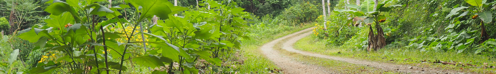

# GoldenCoin (GOLDC)

GoldenCoin is a deflationary token deployed on the Binance Smart Chain under contract [0x7ed52b30ae68463a21994371c3a77d18dd144fc8](https://bscscan.com/token/0x7ed52b30ae68463a21994371c3a77d18dd144fc8).


## Donations to Charity

For every transaction, 1% of it is sent to the [Free the Food](https://giveth.io/project/free-the-food) charity. This project is described as follows.

> 
> Streetside Syntropic. We empower people and communities around the world to plant their streetsides with food. Using Permaculture and Syntropic farming techniques, fruit trees, edible plants, and other companion plants are combined to create a circular and regenerative food system. Why Streetside? All over the world there are streets with empty sides. We convert these spaces into micro food forests to provide free food for the community and spread the message of Syntropic techniques. Planting in this way also builds habitat for wildlife and restores ecological diversity. Why Syntropic? It is one of the most successful and harmonious growing methods for rehabilitating land and growing food. Syntropic agriculture mimics the evolution of a forest and uses techniques to accelerate growth, generate biomass to build soil, and continuously remove CO2 from the air. This successional planting method is a permanent and evolving system that provides food forever. How It Works? We provide Syntropic education, step-by-step guidance, and micro-grants to help communities start and maintain a fruitful streetside. These teams use social media to share the evolution of their planting journey while also seeding Syntropic knowledge worldwide. We use discord as a forum to discuss, share, and learn together. We provide 100% transparency with donation allocation and use of funds. 501c3 coming soon. We currently have 3 streetsides planted in Costa Rica with 2 more waiting to be planted. We are also developing a community food forest on a donated piece of land. This is the pilot project for phase 2. We are currently seeking donations for website development, 501c3 incorporation, legal advice, tools, seeds/trees, water tanks, irrigation drip line, and $100USD/month for 1 person. Thank you for your contributions to help heal soil, sequester carbon, and grow food for the world!

## Supply and Future Ambitions

The deflation occurs by burning 1% off every transaction, which not only limits the supply, but incentivises holding it due to the increasing rarity.

The initial token supply was 2 billion GOLDC. 1 billion was sent to [0x0](https://bscscan.com/tx/0x510759e7424e564dec4835002b9ebbb13223f85c70b89d2d4cf2cd5f2590074e) for burning. GOLDC liquidity was also added to the [PancakeSwap liquidity pool](https://pancakeswap.finance/add/0x7ed52b30ae68463a21994371c3a77D18DD144fc8/BNB).

## Eco-friendly Finance

The goal of this project was to be lightweight and built on a proof-of-stake (PoS) consensus protocol. The lightweight nature of the coin ensures that no gas is wasted, and PoS enables the token to have a low impact on the environment, avoid all unnecessary computation, and have high throughput during network congestion. By donating 1% of every transaction to the [Free The Food](https://giveth.io/project/free-the-food) cause, GOLDC supports the building of habitats and restoration of wildlife and ecological diversity.

## How to Buy

Using the [TrustWallet](https://trustwallet.com/) app (or any Smart Chain wallet), navigate to the DApp: [PancakeSwap](https://exchange.pancakeswap.finance/#/swap?outputCurrency=0x7ed52b30ae68463a21994371c3a77d18dd144fc8), and connect your wallet by selecting "Connect".

In the "From" field, select the token you'd like to transfer, then in the "To" field, enter the smart contract for GOLDC:
```
0x7ed52b30ae68463a21994371c3a77d18dd144fc8
```
If the transaction fails, be sure to incrementally increase the slippage percentage within the PancakeSwap settings. At the time of writing this, 6% is the minimum slippage for a successful transaction.

## How to Contribute

The PancakeSwap liquidity pool is what determines the price of GOLDC. By contributing a combination of both BNB and GOLDC to the pool, this will allow the exchange enough liquidity to swap between the tokens in higher volumes. Not only is this beneficial to the token by reducing the slippage, but it also gives all contributors rewards in the form of Pancake LPs. When the demand for the token is high, contributors will see high profitability.

To become a liquidity pool contributor, navigate to the "Liquidity" tab in PancakeSwap. Similar to token swapping, paste the contract address for GOLDC, select the amount of SIM and another token to contribute, then select the "Supply" button.

---
**Thank you.**